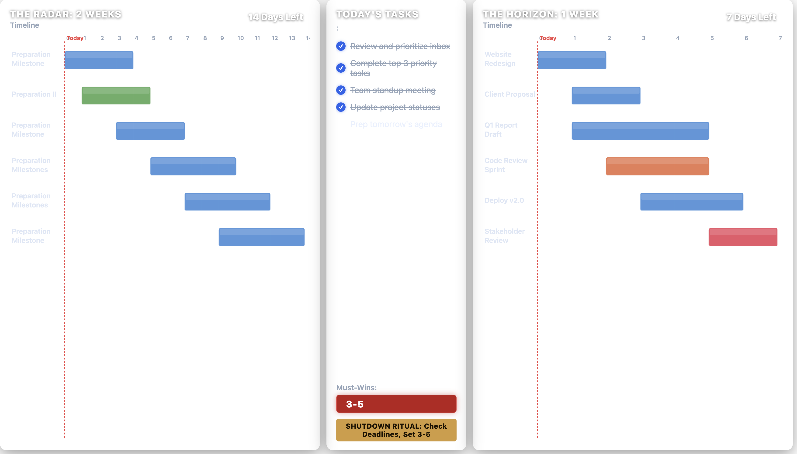

# Wallpaper Planner

A productivity planner overlay for your macOS desktop wallpaper. It layers Gantt-style project timelines and a daily task list on top of your existing wallpaper, turning your desktop into an always-visible planning dashboard — powered by [Plash](https://sindresorhus.com/plash).


The planner panels are semi-transparent, so your wallpaper shows through:



---

## Requirements

- macOS
- [Plash](https://sindresorhus.com/plash) (free, Mac App Store)

---

## Setup

### 1 — Add a background image

Place any JPG/PNG in this folder and set its filename in `tasks.js`:

```js
appearance: {
  wallpaper: "wallpaper.jpg",  // your image filename
}
```

To extract your current macOS wallpaper:

```bash
# Find your current wallpaper (Sequoia)
sips -s format jpeg /System/Library/Wallpapers/.default/DefaultAerial.heic \
  --out wallpaper.jpg
```

Or set `wallpaper: ""` and enable **Transparent Background** in Plash to let macOS's live wallpaper show through.

### 2 — Install Plash and point it at the dashboard

1. Install [Plash](https://sindresorhus.com/plash) from the Mac App Store
2. Click the Plash menu bar icon → **Open URL…** → choose **Local Website**
3. Select this folder (`wallpaper-planner/`) — Plash will serve `index.html`
4. The dashboard appears as your wallpaper immediately

### 3 — Edit `tasks.js` to set your content

Open `tasks.js` in any text editor, update your tasks and Gantt bars, save, then click the Plash icon → **Reload**.

---

## Configuration (`tasks.js`)

This is the only file you need to edit day-to-day.

### Daily tasks

```js
dailyTasks: [
  { text: "Review and prioritize inbox",   done: true  },
  { text: "Complete top 3 priority tasks", done: false },
  { text: "Team standup meeting",          done: false },
],
```

- `done: true` — filled circle with strikethrough
- `done: false` — empty circle (pending)

### Gantt charts

Days are relative to today (`0` = today):

```js
weekProjects: [   // 0–7 days
  { name: "Website Redesign", start: 0, end: 3, color: "#4a90d9" },
  { name: "Client Deadline",  start: 4, end: 7, color: "#e84a5f" },
],

twoWeekProjects: [  // 0–14 days
  { name: "Prep Milestone", start: 0,  end: 5,  color: "#4a90d9" },
  { name: "Launch Prep",    start: 6,  end: 12, color: "#e8734a" },
],
```

**Color guide:**

| Hex | Use |
|---|---|
| `#4a90d9` | Normal / in-progress |
| `#5ba85b` | On-track / nearly done |
| `#e8734a` | At risk |
| `#e84a5f` | Critical / overdue |
| `#9b6dff` | Blocked / waiting |
| `#f0c040` | On hold |

### Appearance

```js
appearance: {
  wallpaper:      "wallpaper.jpg", // background image filename, or "" for transparent
  scrimOpacity:   0.38,            // dark overlay: 0.0 (none) → 1.0 (black)
  panelOpacity:   0.62,            // glass fill:   0.0 (clear) → 1.0 (solid)
  panelBlur:      22,              // backdrop blur in px
  panelRadius:    14,              // corner radius in px
  panelGap:       14,              // gap between panels in px
  columns: {
    left:   "1fr",    // 2-week radar width
    center: "300px",  // command center width
    right:  "1fr",    // 1-week horizon width
  },
  ganttLabelWidth: 118,            // px — label column in Gantt charts
  showTopbar:     false,           // show/hide date & time bar
  baseFontSize:   15,              // px — scales all text
  textColor:      "#f0f6ff",
  mutedColor:     "#94a3b8",
  todayLineColor: "#ef4444",
  mustWinsColor:  "#b91c1c",
},
```

---

## Exporting as a static PNG wallpaper (optional)

If you don't use Plash, you can render the dashboard to a PNG and set it as a standard macOS wallpaper:

```bash
./export-wallpaper.sh              # renders at 3456×2234 (MacBook Pro 16" native)
./export-wallpaper.sh 2560 1600    # custom resolution
```

Requires Google Chrome to be installed.

---

## File structure

```
wallpaper-planner/
├── index.html          ← dashboard UI (edit for deep customisation)
├── tasks.js            ← your daily config — edit this
├── wallpaper.jpg       ← background image (add your own, gitignored)
├── export-wallpaper.sh ← optional: render to PNG wallpaper
├── manual.pdf          ← full user manual
└── manual.typ          ← Typst source for the manual
```
